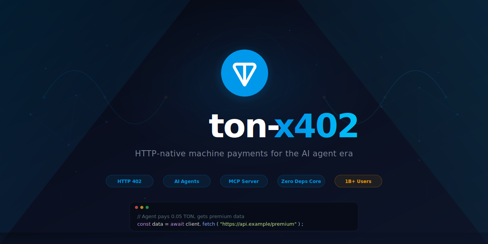
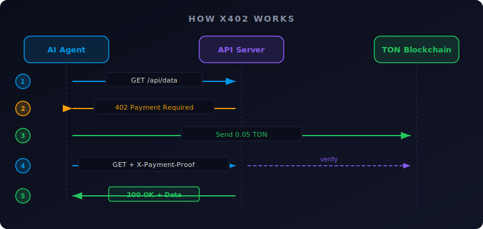
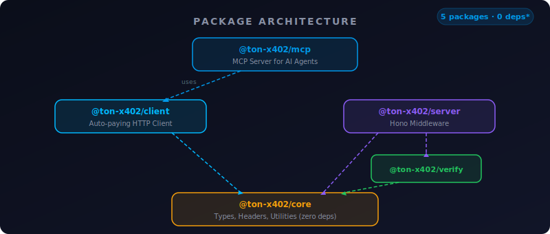

<p align="center">
  
</p>

<p align="center">
  <strong>The first x402 implementation on TON &mdash; HTTP-native machine payments for the AI agent era</strong>
</p>

<p align="center">
  <a href="https://github.com/Arusasaki/ton-x402/actions/workflows/ci.yml"></a>
  <a href="https://opensource.org/licenses/MIT"></a>
  <a href="https://ton-x402.pages.dev"></a>
  <a href="https://www.typescriptlang.org/"></a>
  
  
</p>

<p align="center">
  <a href="#the-problem">Problem</a> &bull;
  <a href="#how-it-works">Protocol</a> &bull;
  <a href="#ai-agent-infrastructure-mcp">AI Agents</a> &bull;
  <a href="#quick-start">Quick Start</a> &bull;
  <a href="#live-demo">Live Demo</a> &bull;
  <a href="#architecture">Architecture</a> &bull;
  <a href="#roadmap">Roadmap</a>
</p>

---

<table>
<tr>
<td align="center" width="160">
<br/>
<sub><strong>Telegram Users</strong></sub><br/>
<sub>Instant wallet access</sub>
</td>
<td align="center" width="160">
<br/>
<sub><strong>Settlement</strong></sub><br/>
<sub>Within HTTP timeout</sub>
</td>
<td align="center" width="160">
<br/>
<sub><strong>Per Transaction</strong></sub><br/>
<sub>Viable micropayments</sub>
</td>
<td align="center" width="160">
<br/>
<sub><strong>Tests Passing</strong></sub><br/>
<sub>Across 5 packages</sub>
</td>
<td align="center" width="160">
<br/>
<sub><strong>Core Dependencies</strong></sub><br/>
<sub>Lightweight & auditable</sub>
</td>
</tr>
</table>

---

## The Problem

Today, when an AI agent needs to access a paid API, it faces a fundamental barrier:

```
Agent wants premium data
  -> Needs an API key (provisioned by a human)
  -> Needs a subscription plan (set up in advance)
  -> Needs billing integration (payment processor account)
  -> Needs human approval (for every new service)
```

**This is the bottleneck of the AI agent economy.** Agents can browse, reason, and act autonomously &mdash; but they can't pay. Every paid API requires a human to pre-configure access. This doesn't scale to a world where agents autonomously discover, evaluate, and consume thousands of services.

### The Solution

[**x402**](https://www.x402.org/) is an open protocol that repurposes the long-unused `HTTP 402 Payment Required` status code to enable machine-to-machine payments at the HTTP layer. Instead of API keys and subscriptions, **payment becomes part of the HTTP conversation itself**.

**ton-x402** is the first x402 implementation on [TON](https://ton.org/) &mdash; the blockchain embedded in Telegram, with native wallet access for over 1 billion users.

```
Agent requests premium data
  -> Gets 402 Payment Required (with payment details)
  -> Sends 0.05 TON (~$0.01, confirms in ~5s)
  -> Retries request with payment proof
  -> Gets the data. Done.

No API keys. No subscriptions. No humans in the loop.
```

> **x402 already exists on Base, Solana, Ethereum, and Aptos.**
> **ton-x402 is the first implementation that includes a full MCP server** &mdash; giving any AI agent (Claude, GPT, Gemini) the ability to pay for services autonomously through the [Model Context Protocol](https://modelcontextprotocol.io/).

---

## Why TON?

The x402 protocol can run on any blockchain. We built on TON because it uniquely solves three problems that make agent payments practical:

| Challenge | How TON Solves It | Why It Matters |
|:----------|:------------------|:---------------|
| **Distribution** | 1B+ Telegram users already have TON wallets | No wallet onboarding needed. The largest ready-made user base for any blockchain payment system. |
| **Speed** | ~5 second finality | Payments confirm within standard HTTP timeout windows (30s). No polling, no webhooks, no async complexity. |
| **Cost** | ~$0.01 per transaction | Micropayments become economically viable. Charge per API call, not per month. A $0.01 fee on a $0.01 payment is 100%; a $0.01 fee on a $0.05 payment is 20% &mdash; still practical. |
| **Ecosystem** | Telegram Mini Apps, bots, TON DeFi | Native integration path from AI agent payments to consumer-facing Telegram experiences. |

No other blockchain offers all four simultaneously. Ethereum is too expensive for micropayments. Solana and Base are fast and cheap but lack the built-in distribution. **TON is the only chain where your payment infrastructure is already in 1 billion people's pockets.**

---

## How It Works

<p align="center">
  
</p>

The x402 payment flow is fully automatic and transparent to the application layer:

| Step | Actor | Action |
|:----:|:------|:-------|
| **1** | Client | Sends a normal HTTP request to a protected endpoint |
| **2** | Server | Responds with `402 Payment Required` + payment details (recipient, amount, token, expiry) |
| **3** | Client | Sends TON to the specified address on-chain (~5 seconds, ~$0.01 fee) |
| **4** | Client | Retries the original request with `X-Payment-Proof` header (base64-encoded transaction BOC) |
| **5** | Server | Verifies the payment on-chain via TON RPC, then returns the requested data |

From the application's perspective, it's just a normal HTTP request that returns data. The entire payment negotiation happens under the hood. The developer never touches wallet logic, transaction signing, or blockchain state.

### Protocol Headers

| Header | Direction | Description |
|:-------|:---------:|:------------|
| `X-Payment-Protocol` | Response | Protocol identifier (`x402-ton`) |
| `X-Payment-Proof` | Request | Base64-encoded transaction BOC (Bag of Cells) |
| `X-Payment-Id` | Request | Unique payment ID for idempotency |
| `X-Payment-Sender` | Request | Sender's TON wallet address (raw format) |

---

## AI Agent Infrastructure (MCP)

**This is the core differentiator.** ton-x402 doesn't just implement the x402 protocol &mdash; it ships a complete [Model Context Protocol](https://modelcontextprotocol.io/) (MCP) server that gives any AI agent autonomous payment capabilities.

> **No other x402 implementation on any blockchain includes an MCP server.**
> ton-x402 is the only project that bridges HTTP-native payments with AI agent infrastructure.

### How It Works with AI Agents

```
┌─────────────────────────────────────────────────────────────────┐
│  AI Agent (Claude, GPT, Gemini, or any MCP-compatible agent)   │
│                                                                 │
│  "Fetch me the latest market data from this premium API"        │
│                                                                 │
│  ┌─────────────────────────────────┐                            │
│  │  MCP Tool: x402_fetch           │                            │
│  │  1. GET /api/premium/data       │─── 402 Payment Required    │
│  │  2. Parse payment requirements  │                            │
│  │  3. Check safety limits         │                            │
│  │  4. Send TON payment on-chain   │─── ~5s, ~$0.01             │
│  │  5. Retry with payment proof    │─── 200 OK + data           │
│  └─────────────────────────────────┘                            │
│                                                                 │
│  "Here's the market data you requested. I paid 0.05 TON."      │
└─────────────────────────────────────────────────────────────────┘
```

### Setup (3 minutes)

```bash
npm install @ton-x402/mcp
```

Add to your agent's MCP configuration (e.g., `claude_desktop_config.json`):

```json
{
  "mcpServers": {
    "ton-x402": {
      "command": "npx",
      "args": ["ton-x402-mcp"],
      "env": {
        "TON_MNEMONIC": "word1 word2 ... word24",
        "TON_NETWORK": "testnet"
      }
    }
  }
}
```

The agent automatically receives 4 tools:

| Tool | Description | Safety |
|:-----|:------------|:-------|
| **`x402_fetch`** | Fetch any URL. If 402 is returned, automatically pay and retry. | Enforces `maxAutoPayAmount` limit per request |
| **`x402_balance`** | Check the agent's TON wallet balance before committing to payments. | Read-only, no funds at risk |
| **`x402_estimate`** | Preview the cost of a protected endpoint without paying. | Dry run &mdash; no transaction sent |
| **`x402_history`** | View recent payment transactions for audit and debugging. | Read-only transaction log |

### What This Enables

| Use Case | Scenario | Market Size |
|:---------|:---------|:------------|
| **Autonomous Research** | AI agents pay for premium data APIs, academic databases, market feeds &mdash; no human setup needed | $50B+ data API market |
| **API Monetization** | Any developer can monetize an API with 3 lines of code &mdash; no Stripe, no auth system required | 30M+ developers building APIs |
| **Agent-to-Agent Commerce** | AI agents sell services to other agents, creating autonomous economic networks | Emerging &mdash; x402 is the standard |
| **Telegram Bot Economy** | 1B+ Telegram users access paid services through bots with native TON wallets | 12M+ monthly active Telegram bots |
| **Per-Request Pricing** | Charge $0.001-$1 per API call instead of $29/month &mdash; pay only for what you use | Fairer for consumers, higher LTV for providers |

---

## Quick Start

### Monetize Any API (Server &mdash; 3 lines)

```bash
npm install @ton-x402/server
```

```typescript
import { Hono } from "hono";
import { x402 } from "@ton-x402/server";

const app = new Hono();

// One middleware to require payment for any route
app.use("/api/premium/*", x402({
  recipient: "UQB...your-wallet",
  amount: "0.05",        // 0.05 TON per request (~$0.12)
  network: "testnet",
}));

app.get("/api/premium/data", (c) => {
  return c.json({ data: "premium content" });
});
```

**That's it.** Any request to `/api/premium/*` now requires a TON payment. No database, no auth system, no payment processor.

### Auto-Pay for APIs (Client)

```bash
npm install @ton-x402/client
```

```typescript
import { X402Client } from "@ton-x402/client";

const client = new X402Client({
  mnemonic: process.env.TON_MNEMONIC!.split(" "),
  network: "testnet",
  maxAutoPayAmount: "0.1",  // Safety: never pay more than 0.1 TON per request
});

// Just fetch — payment is automatic
const response = await client.fetch("https://api.example.com/premium/data");
const data = await response.json();
// If the endpoint returns 402, client automatically pays and retries.
// If it returns 200, the response passes through unchanged.
```

---

## Architecture

<p align="center">
  
</p>

### Package Dependency Graph

```
@ton-x402/mcp          MCP server for AI agents
  └── @ton-x402/client  Auto-paying HTTP client
        └── @ton-x402/core    Types, headers, utilities (zero deps)

@ton-x402/server        Hono middleware for API providers
  ├── @ton-x402/verify  On-chain payment verification
  │     └── @ton-x402/core
  └── @ton-x402/core
```

### Package Details

| Package | Purpose | Source Lines | Tests | External Deps |
|:--------|:--------|:-----------:|:-----:|:-------------:|
| **@ton-x402/core** | Types, HTTP headers, nano-to-TON conversion | 125 | 14 | **0** |
| **@ton-x402/verify** | On-chain payment verification via TON RPC | 124 | 5 | @ton/ton, @ton/core |
| **@ton-x402/server** | Hono middleware &mdash; drop-in payment gating | 89 | 4 | core + verify |
| **@ton-x402/client** | Auto-paying HTTP client with safety limits | 218 | 8 | core + @ton/* |
| **@ton-x402/mcp** | MCP server with 4 tools for AI agents | 223 | 3 | client + @modelcontextprotocol/sdk |
| **Total** | | **779** | **34** | |

**Design principles:**

- **Use only what you need.** API providers: `@ton-x402/server`. API consumers: `@ton-x402/client`. AI platforms: `@ton-x402/mcp`.
- **Zero-dep core.** `@ton-x402/core` has no external dependencies &mdash; the foundational layer is completely self-contained, lightweight, and auditable.
- **Strict TypeScript.** Every package uses `strict: true` with no `any` types. Full type inference from protocol headers to payment amounts.
- **Monorepo with Turborepo.** Parallel builds, incremental caching, single `npm test` runs all 34 tests across all packages.

---

## Technical Highlights

### On-Chain Verification

The server doesn't trust payment claims &mdash; it verifies them on-chain:

```typescript
// @ton-x402/verify internals (simplified)
// 1. Decode the base64 BOC (Bag of Cells) from X-Payment-Proof header
// 2. Query TON RPC for the transaction by hash
// 3. Verify: sender matches X-Payment-Sender
// 4. Verify: recipient matches the configured wallet
// 5. Verify: amount >= required payment amount
// 6. Verify: transaction timestamp is within expiry window
// 7. Verify: paymentId matches (prevents replay attacks)
```

### Safety Limits

The client enforces configurable safety limits to prevent runaway spending:

```typescript
const client = new X402Client({
  maxAutoPayAmount: "0.1",  // Per-request ceiling
  // Client will REFUSE to pay if any 402 response demands more than 0.1 TON
  // This protects agents from malicious or misconfigured servers
});
```

### Idempotency

Every payment includes a unique `paymentId` (UUID v4). The server tracks payment IDs to prevent double-spending &mdash; if a client retries a request with a previously used payment, the server returns the cached response without requiring a new payment.

### Zero External Dependencies in Core

`@ton-x402/core` is the foundation all other packages depend on. It has **zero npm dependencies** &mdash; no supply chain risk, no version conflicts, no bloat. It provides:

- `X402Headers` &mdash; type-safe header constants (`X-Payment-Protocol`, `X-Payment-Proof`, etc.)
- `toNano()` / `fromNano()` &mdash; TON unit conversion (1 TON = 10^9 nanoTON)
- `PaymentRequirements` / `PaymentProof` &mdash; TypeScript interfaces for the protocol

---

## Live Demo

A fully interactive demo is deployed on Cloudflare Workers &mdash; no installation required:

<p align="center">
  <a href="https://ton-x402.pages.dev">
    
  </a>
</p>

The demo features:
- **Interactive landing page** with animated protocol flow visualization
- **Live API explorer** &mdash; test endpoints directly from the browser
- **Real 402 responses** with full payment requirement headers
- **Terminal animation** showing an AI agent autonomously paying for data

### Test the API

```bash
# Free endpoint (200 OK)
curl https://ton-x402.pages.dev/api/info

# Protected endpoint (402 Payment Required)
curl -i https://ton-x402.pages.dev/api/premium/joke
```

**402 response example:**

```json
{
  "version": "1.0",
  "network": "testnet",
  "recipient": "UQDrjaLahLkMB-hMCmkzOyBuHJ186Kj3BzU3sHUecE2eEPz4",
  "amount": "10000000",
  "token": "TON",
  "description": "Access premium joke",
  "paymentId": "550e8400-e29b-41d4-a716-446655440000",
  "expiresAt": 1711929600
}
```

---

## x402 Across Blockchains

| Feature | TON | Base | Solana | Ethereum | Aptos |
|:--------|:---:|:----:|:------:|:--------:|:-----:|
| x402 Protocol | **Yes** | Yes | Yes | Yes | Yes |
| **MCP Server (AI Agents)** | **Yes** | No | No | No | No |
| Finality | ~5s | ~2s | ~0.4s | ~12s | ~1s |
| Transaction Fee | ~$0.01 | ~$0.01 | ~$0.001 | $1-10 | ~$0.001 |
| Micropayments Viable | **Excellent** | Good | Excellent | Poor | Excellent |
| Built-in User Base | **1B+ (Telegram)** | Growing | Growing | Large | Growing |
| Telegram Integration | **Native** | No | No | No | No |
| Stablecoin Support | Roadmap | Yes | Yes | Yes | Yes |

**Key differentiator:** ton-x402 is the **only x402 implementation on any blockchain** that includes a built-in MCP server for AI agent integration. Other implementations require separate tooling to connect to AI agents.

---

## Roadmap

| Phase | Features | Status |
|:------|:---------|:------:|
| **v0.1 &mdash; Foundation** | Core protocol, server middleware, client, MCP server, demo | **Shipped** |
| **v0.2 &mdash; Stablecoins** | USDT (EQCxE6m...) support, multi-token payment negotiation | Planned |
| **v0.3 &mdash; Jettons** | Arbitrary Jetton support, token allowlists, price feeds | Planned |
| **v0.4 &mdash; Telegram** | Telegram Mini App SDK, in-chat payment flows, bot framework integration | Planned |
| **v0.5 &mdash; Production** | Mainnet deployment, rate limiting, payment streaming, analytics dashboard | Planned |

### Community & Contributions

ton-x402 is fully open source (MIT). We welcome contributions:

- **New payment tokens** &mdash; add support for additional Jettons
- **Framework integrations** &mdash; Express, Fastify, Nitro adapters
- **Language SDKs** &mdash; Python, Go, Rust clients
- **Telegram integrations** &mdash; Mini App components, bot payment flows

See [CONTRIBUTING.md](CONTRIBUTING.md) for guidelines.

---

## Development

```bash
# Clone and install
git clone https://github.com/Arusasaki/ton-x402.git && cd ton-x402
npm install

# Build all packages (parallel via Turborepo)
npm run build

# Run all 34 tests across 5 packages
npm test

# Type check (strict mode, no any)
npm run typecheck
```

### Tech Stack

| Tool | Purpose |
|:-----|:--------|
| [TypeScript](https://www.typescriptlang.org/) | Language (strict mode) |
| [Turborepo](https://turbo.build/) | Monorepo build orchestration |
| [tsup](https://tsup.egoist.dev/) | Package bundling (ESM + CJS) |
| [Vitest](https://vitest.dev/) | Testing framework |
| [Hono](https://hono.dev/) | HTTP framework (server middleware + demo) |
| [@ton/ton](https://github.com/ton-org/ton) | TON blockchain SDK |
| [@modelcontextprotocol/sdk](https://github.com/modelcontextprotocol/typescript-sdk) | MCP server SDK |
| [Cloudflare Workers](https://workers.cloudflare.com/) | Demo deployment |

---

<p align="center">
  <a href="https://opensource.org/licenses/MIT">MIT License</a> &mdash; open source, free to use, modify, and distribute.
</p>

<p align="center">
  <sub>Built for the <a href="https://ton.org/">TON</a> ecosystem. Powered by the <a href="https://www.x402.org/">x402</a> protocol.</sub>
</p>
